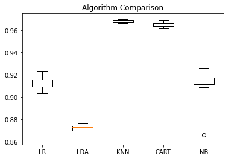

# 1- INTRODUCTION

<div style="text-align: justify">The dataset explored in this assignment presents several observations from a haulage company regarding to fails on the APS system and other systems of trucks. The scenaria that will be studied is presented below:</div>

#### Scenario:

<div style="text-align: justify">You have been retained by a haulage company to analyse a dataset based on data collected from heavy Scania trucks in everyday usage. The system in focus is the Air Pressure system (APS) which generates pressurised air that are utilized in various functions in a truck, such as braking and gear changes. The dataset’s  positive class consists of component failures for a specific component of the APS system.  The negative class consists of trucks with failures for components not related to the APS. The data consists  of a subset of all available data, selected by experts. This analysis will help determine the investment strategy for the company in the upcoming year.<br>

This project will focus in discovering how many features are necessary to retain 99.5% of information of the dataset using different approaches, applying PCA to reduce the number of features and creating a predictive model that tries to identify whether a fail was occasioned by APS system or not.<br>

Different strategies will be applied aiming to get the best answer from the dataset. A function that inputs different criteria to change strategies will be created by the end easing the process of attempting to get better results. </div>

# 2- IMPORTING ALL THE LIBRARIES

<div style="text-align: justify">To facilitate understanding of the coding and keep it as neat as possible, all the libraries are imported by the beginning, independently of exactly where on the code it will be used.</div>


```python
import pandas as pd
import numpy as np
import seaborn as sns
import matplotlib.pyplot as plt
from scipy.stats import shapiro
from scipy.stats import kstest
from sklearn.preprocessing import StandardScaler
```


```python
from sklearn.model_selection import train_test_split
from sklearn.metrics import accuracy_score, confusion_matrix, recall_score
import warnings
warnings.filterwarnings('ignore') # We can suppress the warnings
```


```python
from sklearn.decomposition import PCA
```


```python
from collections import Counter
from sklearn.datasets import make_classification
from imblearn.over_sampling import SMOTE # doctest: +NORMALIZE_WHITESPAC
```


```python
from matplotlib import pyplot
from sklearn.model_selection import train_test_split
from sklearn.model_selection import cross_val_score
from sklearn.model_selection import StratifiedKFold
from sklearn.linear_model import LogisticRegression
from sklearn.tree import DecisionTreeClassifier
from sklearn.neighbors import KNeighborsClassifier
from sklearn.discriminant_analysis import LinearDiscriminantAnalysis
from sklearn.naive_bayes import GaussianNB
from sklearn.metrics import classification_report
from sklearn.metrics import confusion_matrix
from sklearn.metrics import accuracy_score
from sklearn.svm import SVC
from imblearn.over_sampling import SMOTE 
```

# 3- READING THE DATASET AND APPLYING EXPLORATORY DATA ANALYSIS

The first step is reading the dataset and starting looking to it aiming to understand general ideas and patterns within the dataset.


```python
df = pd.read_csv('aps_failure_set.csv')
```


```python
#Visualizing the dataset to identify preliminarily features

df.head()
```


<div>
<style scoped>
    .dataframe tbody tr th:only-of-type {
        vertical-align: middle;
    }

    .dataframe tbody tr th {
        vertical-align: top;
    }

    .dataframe thead th {
        text-align: right;
    }
</style>
<table border="1" class="dataframe">
  <thead>
    <tr style="text-align: right;">
      <th></th>
      <th>class</th>
      <th>aa_000</th>
      <th>ab_000</th>
      <th>ac_000</th>
      <th>ad_000</th>
      <th>ae_000</th>
      <th>af_000</th>
      <th>ag_000</th>
      <th>ag_001</th>
      <th>ag_002</th>
      <th>...</th>
      <th>ee_002</th>
      <th>ee_003</th>
      <th>ee_004</th>
      <th>ee_005</th>
      <th>ee_006</th>
      <th>ee_007</th>
      <th>ee_008</th>
      <th>ee_009</th>
      <th>ef_000</th>
      <th>eg_000</th>
    </tr>
  </thead>
  <tbody>
    <tr>
      <th>0</th>
      <td>neg</td>
      <td>76698</td>
      <td>na</td>
      <td>2130706438</td>
      <td>280</td>
      <td>0</td>
      <td>0</td>
      <td>0</td>
      <td>0</td>
      <td>0</td>
      <td>...</td>
      <td>1240520</td>
      <td>493384</td>
      <td>721044</td>
      <td>469792</td>
      <td>339156</td>
      <td>157956</td>
      <td>73224</td>
      <td>0</td>
      <td>0</td>
      <td>0</td>
    </tr>
    <tr>
      <th>1</th>
      <td>neg</td>
      <td>33058</td>
      <td>na</td>
      <td>0</td>
      <td>na</td>
      <td>0</td>
      <td>0</td>
      <td>0</td>
      <td>0</td>
      <td>0</td>
      <td>...</td>
      <td>421400</td>
      <td>178064</td>
      <td>293306</td>
      <td>245416</td>
      <td>133654</td>
      <td>81140</td>
      <td>97576</td>
      <td>1500</td>
      <td>0</td>
      <td>0</td>
    </tr>
    <tr>
      <th>2</th>
      <td>neg</td>
      <td>41040</td>
      <td>na</td>
      <td>228</td>
      <td>100</td>
      <td>0</td>
      <td>0</td>
      <td>0</td>
      <td>0</td>
      <td>0</td>
      <td>...</td>
      <td>277378</td>
      <td>159812</td>
      <td>423992</td>
      <td>409564</td>
      <td>320746</td>
      <td>158022</td>
      <td>95128</td>
      <td>514</td>
      <td>0</td>
      <td>0</td>
    </tr>
    <tr>
      <th>3</th>
      <td>neg</td>
      <td>12</td>
      <td>0</td>
      <td>70</td>
      <td>66</td>
      <td>0</td>
      <td>10</td>
      <td>0</td>
      <td>0</td>
      <td>0</td>
      <td>...</td>
      <td>240</td>
      <td>46</td>
      <td>58</td>
      <td>44</td>
      <td>10</td>
      <td>0</td>
      <td>0</td>
      <td>0</td>
      <td>4</td>
      <td>32</td>
    </tr>
    <tr>
      <th>4</th>
      <td>neg</td>
      <td>60874</td>
      <td>na</td>
      <td>1368</td>
      <td>458</td>
      <td>0</td>
      <td>0</td>
      <td>0</td>
      <td>0</td>
      <td>0</td>
      <td>...</td>
      <td>622012</td>
      <td>229790</td>
      <td>405298</td>
      <td>347188</td>
      <td>286954</td>
      <td>311560</td>
      <td>433954</td>
      <td>1218</td>
      <td>0</td>
      <td>0</td>
    </tr>
  </tbody>
</table>
<p>5 rows × 171 columns</p>
</div>


```python
df.info()
```

    <class 'pandas.core.frame.DataFrame'>
    RangeIndex: 60000 entries, 0 to 59999
    Columns: 171 entries, class to eg_000
    dtypes: int64(1), object(170)
    memory usage: 78.3+ MB


```python
df['class'].value_counts()
```


    neg    59000
    pos     1000
    Name: class, dtype: int64


<div style="text-align: justify">The dataset is composed by 60000 observations and 171 features. The first column of the dataset is named 'class', and it is composed only by categorical values. As it was described on the scenario, it contains information of whether a fail was originated from the APS system or not. The second column straight after 'class' is named 'aa_000', and names of columns go unti 'eg_000' through a logic on which sometimes the same group of letters has differents numbers, for instance 'ee_002, 'ee_003', and so on, and sometimes the string has only number 000.<br>

It is possible to identify that 'class' has 59000 negative observations and 1000 positive observations, what classifies the dataset as highly unbalanced. Therefore is expected that a method to undersampling of oversampling will be necessary to apply machine learning methods on the dataset.<br>

At first sight, it seams the with exception of 'class', all the columns are composed by numeric values. Nevertheless, the function info() returned the information that the dataset is completely composed by categorical variables, exept one lonely feature.<br>

This is ocasioned by mix of variables in the dataset. It is possible to identify immediatly that some columns contain the string "na" amid numerical values, this is responsible to transform this specific column in an object to the coding. While it is possible to just force every column to numerical values and coerce errors, what would transform them into Missing Values, it is necessary first to check if there is any other value that might be important to the understanding of the dataset.<br>

Firstly, as the scenario did not describe any importance regarding name of columns, its names will be changed removing the string '_0' so they can look more neat, and can be called easier in case needed.<br>

The next step is creating a function that tries to transform values in float and in case it is unable to do it, in other word, if the function receives an error, it returns this value. This function was addapted from a function suggested by Martin (2021), and it will be used in this project. This function will be put in loop to try every single value in the dataset out of the column 'class', and an array will be used to store all the values that can not be converted to numeric in the dataset. </div>


```python
df.columns = df.columns.str.replace('_0', '')
```


```python
#This function was addapted from a function presented in the following link.
#https://drawingfromdata.com/pandas/dtypes/finding-invalid-values-in-numerical-columns.html

def check_float(value):
    try:
        float(value)
        return
    except ValueError:
        return value
```


```python
#https://www.datacamp.com/tutorial/loops-python-tutorial?utm_source=google&utm_medium=paid_search&utm_campaignid=19589720818&utm_adgroupid=143216588777&utm_device=c&utm_keyword=&utm_matchtype=&utm_network=g&utm_adpostion=&utm_creative=652967469589&utm_targetid=dsa-1947282172981&utm_loc_interest_ms=&utm_loc_physical_ms=1007850&utm_content=dsa~page~community-tuto&utm_campaign=230119_1-sea~dsa~tutorials_2-b2c_3-n-eu_4-prc_5-na_6-na_7-le_8-pdsh-go_9-na_10-na_11-na&gclid=CjwKCAjw8-OhBhB5EiwADyoY1VTAgGVq3ULs6geWaBi99vsu_wYe3AEah79xolw_76eNOZsTIOCu5BoCboMQAvD_BwE

missingvalues = []
for column in df.iloc[:, 1:]:
    a = df[column].apply(check_float).unique()
    missingvalues = np.append(missingvalues, a)
```


```python
missingvalues = pd.DataFrame(missingvalues)
missingvalues.iloc[:, 0].unique()
```


    array([None, 'na'], dtype=object)


<div style="text-align: justify">It is possible to verify that only values None and 'na' are among the dataset, therefore we identify that there are no important values to be analysed on missing data. Hence, we can apply the method to transform numeric columns into integers and coerce errors. The code below is used with this function, according to Stack Overflow. (n.d.).</div>


```python
cols = df.columns.drop('class')
df[cols] = df[cols].apply(pd.to_numeric, errors = 'coerce')
```

<div style="text-align: justify">After the dataset has been converted entirely to numerical, it is necessary to analyse how much data is missing this dataset, and start making decisions about these missing data.</div>


```python
df.describe()
```


<div>
<style scoped>
    .dataframe tbody tr th:only-of-type {
        vertical-align: middle;
    }

    .dataframe tbody tr th {
        vertical-align: top;
    }

    .dataframe thead th {
        text-align: right;
    }
</style>
<table border="1" class="dataframe">
  <thead>
    <tr style="text-align: right;">
      <th></th>
      <th>aa00</th>
      <th>ab00</th>
      <th>ac00</th>
      <th>ad00</th>
      <th>ae00</th>
      <th>af00</th>
      <th>ag00</th>
      <th>ag01</th>
      <th>ag02</th>
      <th>ag03</th>
      <th>...</th>
      <th>ee02</th>
      <th>ee03</th>
      <th>ee04</th>
      <th>ee05</th>
      <th>ee06</th>
      <th>ee07</th>
      <th>ee08</th>
      <th>ee09</th>
      <th>ef00</th>
      <th>eg00</th>
    </tr>
  </thead>
  <tbody>
    <tr>
      <th>count</th>
      <td>6.000000e+04</td>
      <td>13671.000000</td>
      <td>5.666500e+04</td>
      <td>4.513900e+04</td>
      <td>57500.000000</td>
      <td>57500.000000</td>
      <td>5.932900e+04</td>
      <td>5.932900e+04</td>
      <td>5.932900e+04</td>
      <td>5.932900e+04</td>
      <td>...</td>
      <td>5.932900e+04</td>
      <td>5.932900e+04</td>
      <td>5.932900e+04</td>
      <td>5.932900e+04</td>
      <td>5.932900e+04</td>
      <td>5.932900e+04</td>
      <td>5.932900e+04</td>
      <td>5.932900e+04</td>
      <td>57276.000000</td>
      <td>57277.000000</td>
    </tr>
    <tr>
      <th>mean</th>
      <td>5.933650e+04</td>
      <td>0.713189</td>
      <td>3.560143e+08</td>
      <td>1.906206e+05</td>
      <td>6.819130</td>
      <td>11.006817</td>
      <td>2.216364e+02</td>
      <td>9.757223e+02</td>
      <td>8.606015e+03</td>
      <td>8.859128e+04</td>
      <td>...</td>
      <td>4.454897e+05</td>
      <td>2.111264e+05</td>
      <td>4.457343e+05</td>
      <td>3.939462e+05</td>
      <td>3.330582e+05</td>
      <td>3.462714e+05</td>
      <td>1.387300e+05</td>
      <td>8.388915e+03</td>
      <td>0.090579</td>
      <td>0.212756</td>
    </tr>
    <tr>
      <th>std</th>
      <td>1.454301e+05</td>
      <td>3.478962</td>
      <td>7.948749e+08</td>
      <td>4.040441e+07</td>
      <td>161.543373</td>
      <td>209.792592</td>
      <td>2.047846e+04</td>
      <td>3.420053e+04</td>
      <td>1.503220e+05</td>
      <td>7.617312e+05</td>
      <td>...</td>
      <td>1.155540e+06</td>
      <td>5.433188e+05</td>
      <td>1.168314e+06</td>
      <td>1.121044e+06</td>
      <td>1.069160e+06</td>
      <td>1.728056e+06</td>
      <td>4.495100e+05</td>
      <td>4.747043e+04</td>
      <td>4.368855</td>
      <td>8.830641</td>
    </tr>
    <tr>
      <th>min</th>
      <td>0.000000e+00</td>
      <td>0.000000</td>
      <td>0.000000e+00</td>
      <td>0.000000e+00</td>
      <td>0.000000</td>
      <td>0.000000</td>
      <td>0.000000e+00</td>
      <td>0.000000e+00</td>
      <td>0.000000e+00</td>
      <td>0.000000e+00</td>
      <td>...</td>
      <td>0.000000e+00</td>
      <td>0.000000e+00</td>
      <td>0.000000e+00</td>
      <td>0.000000e+00</td>
      <td>0.000000e+00</td>
      <td>0.000000e+00</td>
      <td>0.000000e+00</td>
      <td>0.000000e+00</td>
      <td>0.000000</td>
      <td>0.000000</td>
    </tr>
    <tr>
      <th>25%</th>
      <td>8.340000e+02</td>
      <td>0.000000</td>
      <td>1.600000e+01</td>
      <td>2.400000e+01</td>
      <td>0.000000</td>
      <td>0.000000</td>
      <td>0.000000e+00</td>
      <td>0.000000e+00</td>
      <td>0.000000e+00</td>
      <td>0.000000e+00</td>
      <td>...</td>
      <td>2.936000e+03</td>
      <td>1.166000e+03</td>
      <td>2.700000e+03</td>
      <td>3.584000e+03</td>
      <td>5.120000e+02</td>
      <td>1.100000e+02</td>
      <td>0.000000e+00</td>
      <td>0.000000e+00</td>
      <td>0.000000</td>
      <td>0.000000</td>
    </tr>
    <tr>
      <th>50%</th>
      <td>3.077600e+04</td>
      <td>0.000000</td>
      <td>1.520000e+02</td>
      <td>1.260000e+02</td>
      <td>0.000000</td>
      <td>0.000000</td>
      <td>0.000000e+00</td>
      <td>0.000000e+00</td>
      <td>0.000000e+00</td>
      <td>0.000000e+00</td>
      <td>...</td>
      <td>2.337960e+05</td>
      <td>1.120860e+05</td>
      <td>2.215180e+05</td>
      <td>1.899880e+05</td>
      <td>9.243200e+04</td>
      <td>4.109800e+04</td>
      <td>3.812000e+03</td>
      <td>0.000000e+00</td>
      <td>0.000000</td>
      <td>0.000000</td>
    </tr>
    <tr>
      <th>75%</th>
      <td>4.866800e+04</td>
      <td>0.000000</td>
      <td>9.640000e+02</td>
      <td>4.300000e+02</td>
      <td>0.000000</td>
      <td>0.000000</td>
      <td>0.000000e+00</td>
      <td>0.000000e+00</td>
      <td>0.000000e+00</td>
      <td>0.000000e+00</td>
      <td>...</td>
      <td>4.383960e+05</td>
      <td>2.182320e+05</td>
      <td>4.666140e+05</td>
      <td>4.032220e+05</td>
      <td>2.750940e+05</td>
      <td>1.678140e+05</td>
      <td>1.397240e+05</td>
      <td>2.028000e+03</td>
      <td>0.000000</td>
      <td>0.000000</td>
    </tr>
    <tr>
      <th>max</th>
      <td>2.746564e+06</td>
      <td>204.000000</td>
      <td>2.130707e+09</td>
      <td>8.584298e+09</td>
      <td>21050.000000</td>
      <td>20070.000000</td>
      <td>3.376892e+06</td>
      <td>4.109372e+06</td>
      <td>1.055286e+07</td>
      <td>6.340207e+07</td>
      <td>...</td>
      <td>7.793393e+07</td>
      <td>3.775839e+07</td>
      <td>9.715238e+07</td>
      <td>5.743524e+07</td>
      <td>3.160781e+07</td>
      <td>1.195801e+08</td>
      <td>1.926740e+07</td>
      <td>3.810078e+06</td>
      <td>482.000000</td>
      <td>1146.000000</td>
    </tr>
  </tbody>
</table>
<p>8 rows × 170 columns</p>
</div>


```python
nullvalues = df.isnull().sum().reset_index(name = 'counting')
```


```python
nullvalues['percentages'] = nullvalues['counting']/len(df['class'])
```


```python
nullvalues.head()
```


<div>
<style scoped>
    .dataframe tbody tr th:only-of-type {
        vertical-align: middle;
    }

    .dataframe tbody tr th {
        vertical-align: top;
    }

    .dataframe thead th {
        text-align: right;
    }
</style>
<table border="1" class="dataframe">
  <thead>
    <tr style="text-align: right;">
      <th></th>
      <th>index</th>
      <th>counting</th>
      <th>percentages</th>
    </tr>
  </thead>
  <tbody>
    <tr>
      <th>0</th>
      <td>class</td>
      <td>0</td>
      <td>0.000000</td>
    </tr>
    <tr>
      <th>1</th>
      <td>aa00</td>
      <td>0</td>
      <td>0.000000</td>
    </tr>
    <tr>
      <th>2</th>
      <td>ab00</td>
      <td>46329</td>
      <td>0.772150</td>
    </tr>
    <tr>
      <th>3</th>
      <td>ac00</td>
      <td>3335</td>
      <td>0.055583</td>
    </tr>
    <tr>
      <th>4</th>
      <td>ad00</td>
      <td>14861</td>
      <td>0.247683</td>
    </tr>
  </tbody>
</table>
</div>


```python
fg = sns.displot(data=nullvalues, x='percentages', stat='percent', kde=True, bins = 4)
```


    

    


<div style="text-align: justify">It is possible to verify that the dataset has over 80% of its data missing less than 20% of information, and almost 10% of its information missing over 50% of information. <br>

In this project, to reduce the amount of missing data, two strategies will be applied:<br>

1- Drop features and index that miss over 50% information.<br>

2- Try different methods to imput the remaining missing data and see its influence in PCD and in the accuracy of machine learning models.<br>

The first step will be drop every feature that miss over 50% of information. To make this, it will be used the matrix nullvalues, and index of percentages over 50% will be dropped in the original dataframe, df.</div>


```python
higher50 = nullvalues[nullvalues['percentages'] >=0.5]
```


```python
print(higher50.shape)
```

    (8, 3)


<div style="text-align: justify">8 features was found to have over 50% of data missing, and they will be, therefore, dropped on the original dataset. They represent 4.7% of the features of the dataset.</div>

<div style="text-align: justify">The same procedure applyed to the columns will be applied to the rows. The intention is drop any observation that presents over 50% of unknown values. In this case it was made a loop to analyse the amount of missing data row by row.</div>


```python
missingrows = pd.DataFrame({'index':[],'counting':[]})
for row in range(len(df)):
    a = df.iloc[row, :].isnull().sum()
    new_row = {'index':row, 'counting': a}
    missingrows = missingrows.append(new_row, ignore_index= True)
```


```python
missingrows['percentages'] = missingrows['counting']/len(df.columns)
```


```python
rowshigher50 = missingrows[missingrows['percentages'] >=0.5]
rowshigher50.head()
```


<div>
<style scoped>
    .dataframe tbody tr th:only-of-type {
        vertical-align: middle;
    }

    .dataframe tbody tr th {
        vertical-align: top;
    }

    .dataframe thead th {
        text-align: right;
    }
</style>
<table border="1" class="dataframe">
  <thead>
    <tr style="text-align: right;">
      <th></th>
      <th>index</th>
      <th>counting</th>
      <th>percentages</th>
    </tr>
  </thead>
  <tbody>
    <tr>
      <th>56</th>
      <td>56.0</td>
      <td>168.0</td>
      <td>0.982456</td>
    </tr>
    <tr>
      <th>164</th>
      <td>164.0</td>
      <td>88.0</td>
      <td>0.514620</td>
    </tr>
    <tr>
      <th>204</th>
      <td>204.0</td>
      <td>92.0</td>
      <td>0.538012</td>
    </tr>
    <tr>
      <th>502</th>
      <td>502.0</td>
      <td>168.0</td>
      <td>0.982456</td>
    </tr>
    <tr>
      <th>1106</th>
      <td>1106.0</td>
      <td>93.0</td>
      <td>0.543860</td>
    </tr>
  </tbody>
</table>
</div>


```python
print(rowshigher50.shape)
```

    (420, 3)


<div style="text-align: justify">It is possible to verify that there are 420 rows has over 50% of data missing, and therefore they will be dropped. They represent aproximately 0.7% of the dataset, and excluding them should not represent big changes on the shape of the data.</div>

<div style="text-align: justify">The next steps will be verifying if the dataset contains any column composed only by unique values, which would make this column useless for predictive models, and also if it has duplicated values.</div>


```python
#Evaluating if there is any column with only unique values.

uniquevalues = []
for column in df:
    a = df[column].is_unique
    uniquevalues = np.append(uniquevalues, a)
```


```python
np.unique(uniquevalues)
```


    array([0.])


There are no columns on the dataset composed only by unique values, therefore no column can be dropped for this reason.

Next, the dataset will be analysed to identify duplicated values.


```python
duplicate_rows_df = df[df.duplicated()]

print('number of duplicate row: ', duplicate_rows_df.shape)
```

    number of duplicate row:  (0, 171)


<div style="text-align: justify">There was no duplicated rows found. The next step will be analyse whether some columns are normal distributions or not. In the case the column is considered a normal distribution, 95% of the values of that column are within 2 standard deviation from the mean. Therefore, we are able to replace missing values for random values 2 standard deviation distant from the mean of this specific column. The normality test can be conducted through a visual approach. However, once in this case the amount of information is too large to analyse graph by graph, statistics data must be applyied to verify normality of the columns. <br>

Two tests are available according to Zach (2022), a Shapiro-test and a Kolmogorov-Smirnov test. Although both test have the same functionality, the Shapiro-test can only handle up to 5000 observations and it is more indicated to small number of samples, according to www.statsdirect.com. (n.d.). Normality Tests and Gupta, A., Mishra, P., Pandey, C., Singh, U., Sahu, C. and Keshri, A. (2019), whereas the Kolmogorov Smirnov test in more indicated to large samples. <br>

In this case the data will be evaluated according to the Kolmogorov-Smirnov test. The Kolmogorov-Smirnov consists in the hypothesis:<br>
H0 - Data comes from a normal distribution.<br>
HA - Data does not come from a normal distribution.<br>
The test returns a p-values in which.<br>
p < 0.05, Reject H0, thus the sample does not come from a normal distribution.<br>
p >= 0.05, Do not reject H0, thus the sample does come from a normal distribution.<br>

The p-value will be calculated in a loop for each column and stored in a dataframe with features. Afterwards, it will be filtered if this dataframe contains any p-value >= 0.05, and in case it has, this features will be considered potential to substituion by its mean.</div>


```python
df.head()
```


<div>
<style scoped>
    .dataframe tbody tr th:only-of-type {
        vertical-align: middle;
    }

    .dataframe tbody tr th {
        vertical-align: top;
    }

    .dataframe thead th {
        text-align: right;
    }
</style>
<table border="1" class="dataframe">
  <thead>
    <tr style="text-align: right;">
      <th></th>
      <th>class</th>
      <th>aa00</th>
      <th>ab00</th>
      <th>ac00</th>
      <th>ad00</th>
      <th>ae00</th>
      <th>af00</th>
      <th>ag00</th>
      <th>ag01</th>
      <th>ag02</th>
      <th>...</th>
      <th>ee02</th>
      <th>ee03</th>
      <th>ee04</th>
      <th>ee05</th>
      <th>ee06</th>
      <th>ee07</th>
      <th>ee08</th>
      <th>ee09</th>
      <th>ef00</th>
      <th>eg00</th>
    </tr>
  </thead>
  <tbody>
    <tr>
      <th>0</th>
      <td>neg</td>
      <td>76698</td>
      <td>NaN</td>
      <td>2.130706e+09</td>
      <td>280.0</td>
      <td>0.0</td>
      <td>0.0</td>
      <td>0.0</td>
      <td>0.0</td>
      <td>0.0</td>
      <td>...</td>
      <td>1240520.0</td>
      <td>493384.0</td>
      <td>721044.0</td>
      <td>469792.0</td>
      <td>339156.0</td>
      <td>157956.0</td>
      <td>73224.0</td>
      <td>0.0</td>
      <td>0.0</td>
      <td>0.0</td>
    </tr>
    <tr>
      <th>1</th>
      <td>neg</td>
      <td>33058</td>
      <td>NaN</td>
      <td>0.000000e+00</td>
      <td>NaN</td>
      <td>0.0</td>
      <td>0.0</td>
      <td>0.0</td>
      <td>0.0</td>
      <td>0.0</td>
      <td>...</td>
      <td>421400.0</td>
      <td>178064.0</td>
      <td>293306.0</td>
      <td>245416.0</td>
      <td>133654.0</td>
      <td>81140.0</td>
      <td>97576.0</td>
      <td>1500.0</td>
      <td>0.0</td>
      <td>0.0</td>
    </tr>
    <tr>
      <th>2</th>
      <td>neg</td>
      <td>41040</td>
      <td>NaN</td>
      <td>2.280000e+02</td>
      <td>100.0</td>
      <td>0.0</td>
      <td>0.0</td>
      <td>0.0</td>
      <td>0.0</td>
      <td>0.0</td>
      <td>...</td>
      <td>277378.0</td>
      <td>159812.0</td>
      <td>423992.0</td>
      <td>409564.0</td>
      <td>320746.0</td>
      <td>158022.0</td>
      <td>95128.0</td>
      <td>514.0</td>
      <td>0.0</td>
      <td>0.0</td>
    </tr>
    <tr>
      <th>3</th>
      <td>neg</td>
      <td>12</td>
      <td>0.0</td>
      <td>7.000000e+01</td>
      <td>66.0</td>
      <td>0.0</td>
      <td>10.0</td>
      <td>0.0</td>
      <td>0.0</td>
      <td>0.0</td>
      <td>...</td>
      <td>240.0</td>
      <td>46.0</td>
      <td>58.0</td>
      <td>44.0</td>
      <td>10.0</td>
      <td>0.0</td>
      <td>0.0</td>
      <td>0.0</td>
      <td>4.0</td>
      <td>32.0</td>
    </tr>
    <tr>
      <th>4</th>
      <td>neg</td>
      <td>60874</td>
      <td>NaN</td>
      <td>1.368000e+03</td>
      <td>458.0</td>
      <td>0.0</td>
      <td>0.0</td>
      <td>0.0</td>
      <td>0.0</td>
      <td>0.0</td>
      <td>...</td>
      <td>622012.0</td>
      <td>229790.0</td>
      <td>405298.0</td>
      <td>347188.0</td>
      <td>286954.0</td>
      <td>311560.0</td>
      <td>433954.0</td>
      <td>1218.0</td>
      <td>0.0</td>
      <td>0.0</td>
    </tr>
  </tbody>
</table>
<p>5 rows × 171 columns</p>
</div>


```python
normaltest = pd.DataFrame({'feature': [], 'stat':[],'pvalue':[]})
for column in df.iloc[:, 1:]:
    stat, pvalue = kstest(df[column].dropna(), 'norm')
    new_row = {'feature': column, 'stat':stat,'pvalue':pvalue}
    normaltest = normaltest.append(new_row, ignore_index= True)
```


```python
normaltest
```


<div>
<style scoped>
    .dataframe tbody tr th:only-of-type {
        vertical-align: middle;
    }

    .dataframe tbody tr th {
        vertical-align: top;
    }

    .dataframe thead th {
        text-align: right;
    }
</style>
<table border="1" class="dataframe">
  <thead>
    <tr style="text-align: right;">
      <th></th>
      <th>feature</th>
      <th>stat</th>
      <th>pvalue</th>
    </tr>
  </thead>
  <tbody>
    <tr>
      <th>0</th>
      <td>aa00</td>
      <td>0.989852</td>
      <td>0.0</td>
    </tr>
    <tr>
      <th>1</th>
      <td>ab00</td>
      <td>0.500000</td>
      <td>0.0</td>
    </tr>
    <tr>
      <th>2</th>
      <td>ac00</td>
      <td>0.832175</td>
      <td>0.0</td>
    </tr>
    <tr>
      <th>3</th>
      <td>ad00</td>
      <td>0.934703</td>
      <td>0.0</td>
    </tr>
    <tr>
      <th>4</th>
      <td>ae00</td>
      <td>0.500000</td>
      <td>0.0</td>
    </tr>
    <tr>
      <th>...</th>
      <td>...</td>
      <td>...</td>
      <td>...</td>
    </tr>
    <tr>
      <th>165</th>
      <td>ee07</td>
      <td>0.859767</td>
      <td>0.0</td>
    </tr>
    <tr>
      <th>166</th>
      <td>ee08</td>
      <td>0.703671</td>
      <td>0.0</td>
    </tr>
    <tr>
      <th>167</th>
      <td>ee09</td>
      <td>0.500000</td>
      <td>0.0</td>
    </tr>
    <tr>
      <th>168</th>
      <td>ef00</td>
      <td>0.500000</td>
      <td>0.0</td>
    </tr>
    <tr>
      <th>169</th>
      <td>eg00</td>
      <td>0.500000</td>
      <td>0.0</td>
    </tr>
  </tbody>
</table>
<p>170 rows × 3 columns</p>
</div>


```python
normaltest[normaltest.pvalue > 0.05]
```


<div>
<style scoped>
    .dataframe tbody tr th:only-of-type {
        vertical-align: middle;
    }

    .dataframe tbody tr th {
        vertical-align: top;
    }

    .dataframe thead th {
        text-align: right;
    }
</style>
<table border="1" class="dataframe">
  <thead>
    <tr style="text-align: right;">
      <th></th>
      <th>feature</th>
      <th>stat</th>
      <th>pvalue</th>
    </tr>
  </thead>
  <tbody>
  </tbody>
</table>
</div>


<div style="text-align: justify">None of the features analysed can be considered normal, therefore applying the mean or values nearby the mean randomly is not a good option, because it is known that the data is not represented by its mean. For the main attempt realized in this project, null values will be imputed by the median of each column, which is more appropriate to data which is not normal. Nevertheless, by the end the option of the mean will be applied to verify and compare results.<br>

All the exploratory analysis is finished at this point, and from now, all the steps to clean the data will be applied, according to the conclusions found in the exploratory analysis, which where:<br>

1 - Removing features with over 50% of missing data.<br>

2 - Removing rows with over 50% of missing data.<br>

3 - Imputing the remaining missing data with its median.</div>

# 4- Cleaning the data

## 4.1- Removing features with over 50% of missing data.


```python
df = df.drop(higher50['index'], axis = 1)
```


```python
df.shape
```


    (60000, 163)


After doing that we can verify that the dataset that had originally 171 features, was reduced to 163.

## 4.2- Removing rows with over 50% of missing data


```python
df.drop(rowshigher50['index'], axis = 0, inplace=True)
```


```python
df.info()
```

    <class 'pandas.core.frame.DataFrame'>
    Int64Index: 59580 entries, 0 to 59999
    Columns: 163 entries, class to eg00
    dtypes: float64(161), int64(1), object(1)
    memory usage: 74.5+ MB


```python
df.reset_index(drop = True, inplace = True)
```

<div style="text-align: justify">It is possible to verify that after these procedure the dataset was reduced from 60000 observations and 171 features, to 59580 observations and 163 features. </div>

## 4.3- Imputing the remaining missing data with its median.


```python
df.isnull().sum()
```


    class        0
    aa00         0
    ac00      3085
    ad00     14493
    ae00      2254
             ...  
    ee07       279
    ee08       279
    ee09       279
    ef00      2476
    eg00      2476
    Length: 163, dtype: int64


```python
print ("The dataset will be imputed in: {0:.3}% of its values." .format(df.isnull().sum().sum()/(len(df['class'])*163)*100))
```

    The dataset will be imputed in: 4.43% of its values.


So the dataset will be imputed in 4.43% of its values, what is not a very high amount.


```python
df2 = df.fillna(df.median())
df2.reset_index(drop = True, inplace=True)
```

<div style="text-align: justify">All steps after this milestones will be explored through a function described in the end of the report. It is possible to input different options desired for imputing missing data, standardization, outliers, oversampling data, and analyse different results without running though all steps again. </div>

# 5- Standardization

<div style="text-align: justify">The necessary steps to standardize the data are described in this section, they were tried, however it was found after all the process that the model developped was not good enough. The number of features to applying PCA was increased, and although the model presented good accuracy, it costed time of processing, and the model did not have a good Recall. In other words, the model presented with standardization looses classifications for true positives, or in this cases, the model does not classify fails in the APS system that should be classified. A resume will be presented by the end of the report with Standardization.</div>

df.reset_index(drop = True, inplace = True)

scaler = StandardScaler()

scaled = scaler.fit_transform(df.drop(columns = ['class']))

df2 = pd.DataFrame(scaled)
df2['class']=df['class']
df2.head()

df2 = df.fillna(df.median())
df2.reset_index(drop = True, inplace=True)

# 6- Detecting Outliers

<div style="text-align: justify">The next step will be identifying and removing outliers. This step will be made separately for positive and negative classes. This will be made because we do not know how the dataset behave in each class, therefore, mean and distribution of the data may be important features of 'pos' and 'neg' class. This step was described in this project, however, it was identified during its execution that models did not behave well with the exclusion of outliers. This happens because the distribution of the data in the dataset is in such a way that almost all the dataset is identified as outlier. The result does change depending on the imputation method used, but overall, in all cases analysed in this report, dropping outliers did not benefited the accurary of models, and in some cases, it made it impossible, because there was not enought values.</div>


```python
#Detecting outliers for positive class
dfpos = df2[(df2['class'] == 'pos')]
Q1pos = dfpos.quantile(0.25)
Q3pos = dfpos.quantile(0.75)
IQRpos = Q3pos - Q1pos
print(IQRpos)
dfpos.shape
```

    aa00     610152.0
    ac00        844.0
    ad00        142.5
    ae00          0.0
    af00          0.0
              ...    
    ee07    2963303.0
    ee08     467607.0
    ee09       1815.5
    ef00          0.0
    eg00          0.0
    Length: 162, dtype: float64


    (992, 163)


```python
dfpos = dfpos[~((dfpos < (Q1pos - 1.5*IQRpos)) | (dfpos > (Q3pos + 1.5*IQRpos))).any(axis=1)]
dfpos.shape
```


    (8, 163)


```python
#Detecting outliers for negative class
dfneg = df2[(df2['class'] == 'neg')]
Q1neg = dfpos.quantile(0.25)
Q3neg = dfpos.quantile(0.75)
IQRneg = Q3neg - Q1neg
print(IQRneg)
dfneg.shape
```

    aa00    161839.0
    ac00        96.0
    ad00         0.0
    ae00         0.0
    af00         0.0
              ...   
    ee07    841208.5
    ee08     65474.0
    ee09       130.0
    ef00         0.0
    eg00         0.0
    Length: 162, dtype: float64


    (58588, 163)


```python
dfneg = dfneg[~((dfneg < (Q1neg - 1.5*IQRneg)) | (dfneg > (Q3neg + 1.5*IQRneg))).any(axis=1)]
dfneg
```


<div>
<style scoped>
    .dataframe tbody tr th:only-of-type {
        vertical-align: middle;
    }

    .dataframe tbody tr th {
        vertical-align: top;
    }

    .dataframe thead th {
        text-align: right;
    }
</style>
<table border="1" class="dataframe">
  <thead>
    <tr style="text-align: right;">
      <th></th>
      <th>class</th>
      <th>aa00</th>
      <th>ac00</th>
      <th>ad00</th>
      <th>ae00</th>
      <th>af00</th>
      <th>ag00</th>
      <th>ag01</th>
      <th>ag02</th>
      <th>ag03</th>
      <th>...</th>
      <th>ee02</th>
      <th>ee03</th>
      <th>ee04</th>
      <th>ee05</th>
      <th>ee06</th>
      <th>ee07</th>
      <th>ee08</th>
      <th>ee09</th>
      <th>ef00</th>
      <th>eg00</th>
    </tr>
  </thead>
  <tbody>
  </tbody>
</table>
<p>0 rows × 163 columns</p>
</div>


The next step would be responsible for recovering the dataset with negative and positive values.

df2 = dfpos.append(dfneg, ignore_index= True)
df2.info()

<div style="text-align: justify">As it is possible to verify above, for a dataset which imputed null values through its median, after analysing and dropping outliers would rest only 8 rows and 163 features! Therefore this step was withdrawn from the main model developed.</div>

## 7- APLLYING SMOTE TO REBALANCE THE DATASET

<div style="text-align: justify">As it was identified during the exploratory data analysis, the dataset is highly unbalanced regarding positive and negative observations, thus, it is an important step to improve accuracy of machine learning model balancing the data. This balacing of the data can be made by oversampling and undersampling. In this project, a method of oversampling will be used to generate synthetic observations for positive classes. The method applied will be SMOTE, and it is described below. The first step consists in splitting the dataset in independent variables and dependent.</div>


```python
#Splitting the dataset in dependent and independent variables
X = df2.drop('class', axis = 1)   #dependent variable 
y = df2['class']
X.shape, y.shape
```


    ((59580, 162), (59580,))


<div style="text-align: justify">As it follows, it is applyied the SMOTE algorithm, which will rebalance the observations in the dataset through oversampling. After applying the function is possible to see the new dataset created has 117176 rows.</div>


```python
smt = SMOTE()

X, y= smt.fit_resample(X, y)
```


```python
X.shape, y.shape
```


    ((117176, 162), (117176,))


## 8- USING PCA METHOD TO DISCOVER NUMBER OF FEATURES TO RATAIN 99.5% OF DATA

<div style="text-align: justify">The next step will be using the PCA method to answer the task proposed on the assignement. To do this process, the first process is enconding the column 'class', to have it as number, and as it follows, verify through the array of the variance ratio, when it will have accumulated 99.5%. </div>


```python
pca = PCA().fit(X)
variance_ratio = np.cumsum(pca.explained_variance_ratio_)
plt.plot(variance_ratio)
plt.xlabel('number of components')
plt.ylabel('cumulative explained variance');
print(np.cumsum(pca.explained_variance_ratio_))
```

    [0.78522634 0.94893315 0.97585108 0.99029984 0.99434995 0.9962949
     0.99770301 0.99835914 0.99863931 0.9988428  0.99901413 0.99914811
     0.99926625 0.99937739 0.99947902 0.99955241 0.99961832 0.99967243
     0.99970944 0.99973763 0.99976147 0.99978422 0.999805   0.99982065
     0.99983448 0.99984799 0.99985958 0.9998709  0.9998812  0.99988975
     0.99989793 0.99990542 0.99991209 0.99991826 0.99992415 0.99992998
     0.99993513 0.99994005 0.99994468 0.99994925 0.99995328 0.99995712
     0.99996047 0.99996356 0.99996647 0.9999689  0.99997128 0.99997345
     0.99997561 0.99997763 0.99997947 0.9999812  0.99998282 0.9999843
     0.99998565 0.99998695 0.99998808 0.99998918 0.99999018 0.99999107
     0.99999194 0.99999272 0.99999348 0.99999415 0.99999477 0.99999535
     0.99999588 0.99999636 0.9999967  0.999997   0.99999727 0.9999975
     0.99999773 0.99999794 0.99999814 0.99999833 0.9999985  0.99999864
     0.99999878 0.9999989  0.99999902 0.99999912 0.99999921 0.99999929
     0.99999937 0.99999944 0.9999995  0.99999956 0.99999961 0.99999965
     0.99999969 0.99999973 0.99999976 0.99999979 0.99999982 0.99999984
     0.99999986 0.99999988 0.99999989 0.99999991 0.99999992 0.99999993
     0.99999994 0.99999995 0.99999996 0.99999997 0.99999998 0.99999998
     0.99999999 0.99999999 0.99999999 0.99999999 0.99999999 0.99999999
     0.99999999 0.99999999 1.         1.         1.         1.
     1.         1.         1.         1.         1.         1.
     1.         1.         1.         1.         1.         1.
     1.         1.         1.         1.         1.         1.
     1.         1.         1.         1.         1.         1.
     1.         1.         1.         1.         1.         1.
     1.         1.         1.         1.         1.         1.
     1.         1.         1.         1.         1.         1.        ]


    

    


To verify the amount of necessary features, instead of just relying in the graphic visualization, it was created a loop to verify the first value above 99.5%.


```python
#Seeking on the array the minimun number of features to retain 99.5% of information in the dataset.

features= -1
for i in range(len(variance_ratio)):
    if variance_ratio[i] > 0.995:
        features= i
        break
features_needed = features+1
print('It is possible to verify that to retain 99.5% of information variation in the dataset, it is necessary {} features.'.format(features_needed))
```

    It is possible to verify that to retain 99.5% of information variation in the dataset, it is necessary 6 features.


```python
pca = PCA(features_needed)
projected = pca.fit_transform(X)
```


```python
projected.shape, y.shape
```


    ((117176, 6), (117176,))


```python
#Creating an authomatic way to name columns aiming to run sequences of tests
columns =[]
for i in range(1, features_needed+1):
    columns = np.append(columns, 'C'+str(i))
```


```python
X_pca = pd.DataFrame(projected, columns = columns)
y.replace(['pos','neg'],[1,0], inplace=True)
```


```python
X_pca.head()
```


<div>
<style scoped>
    .dataframe tbody tr th:only-of-type {
        vertical-align: middle;
    }

    .dataframe tbody tr th {
        vertical-align: top;
    }

    .dataframe thead th {
        text-align: right;
    }
</style>
<table border="1" class="dataframe">
  <thead>
    <tr style="text-align: right;">
      <th></th>
      <th>C1</th>
      <th>C2</th>
      <th>C3</th>
      <th>C4</th>
      <th>C5</th>
      <th>C6</th>
    </tr>
  </thead>
  <tbody>
    <tr>
      <th>0</th>
      <td>1.944000e+09</td>
      <td>9.456531e+06</td>
      <td>3.001785e+06</td>
      <td>1.195445e+07</td>
      <td>19761.411794</td>
      <td>3.154193e+06</td>
    </tr>
    <tr>
      <th>1</th>
      <td>-1.843502e+08</td>
      <td>-4.142014e+07</td>
      <td>-5.349695e+07</td>
      <td>-5.485231e+07</td>
      <td>-270082.329605</td>
      <td>1.884443e+06</td>
    </tr>
    <tr>
      <th>2</th>
      <td>-1.842393e+08</td>
      <td>-4.155004e+07</td>
      <td>-5.688103e+07</td>
      <td>-5.629767e+07</td>
      <td>-275025.628079</td>
      <td>7.694539e+05</td>
    </tr>
    <tr>
      <th>3</th>
      <td>-1.839239e+08</td>
      <td>-4.196438e+07</td>
      <td>-6.083542e+07</td>
      <td>-6.404255e+07</td>
      <td>-290068.350925</td>
      <td>4.602717e+05</td>
    </tr>
    <tr>
      <th>4</th>
      <td>-1.846957e+08</td>
      <td>-4.150080e+07</td>
      <td>-3.630158e+07</td>
      <td>-5.847274e+07</td>
      <td>-263959.066211</td>
      <td>6.538253e+05</td>
    </tr>
  </tbody>
</table>
</div>


```python
y.shape
```


    (117176,)


## 9- APPLYING MACHINE LEARN METHODS TO PREDICT FAILS

<div style="text-align: justify">The first step to apply Machine Learn Methods is splitting the dataset to be analysed in train variables and test variables. The train variables are those used to train the models to create predictions, and the test variables are those used to validate the model and analyse its accurary. The dataset was already split in dependent variable and independent variable before to apply SMOTE and PCA.<br>

In the case of this test it will be used a test size of 25% of the sample, and a training size of 75% of the sample. The random state is defined as 1 only to make possible reproductbility.</div>


```python
X_pca_train, X_pca_test, y_train, y_test = train_test_split(X_pca, y, random_state = 1, stratify=y, test_size = 0.25)
```


```python
np.bincount(y_train)
```


    array([43941, 43941])


<div style="text-align: justify">The final step will be applying different Machine Learning Models to predict wheather a fail was occasioned in the APS system or not. The models explored are Logistic Regression, Linear Discriminant Analysis, K Neighbors Classified, Decision Tree Classifier and Gaussian Naive Bayes. At the beginning, Support Vacuum Machine was also tested, however it did not showed results, therefore it was let of the analysis. </div>


```python
models = []
models.append(('LR', LogisticRegression(solver='liblinear', multi_class='ovr')))
models.append(('LDA', LinearDiscriminantAnalysis()))
models.append(('KNN', KNeighborsClassifier()))
models.append(('CART', DecisionTreeClassifier()))
models.append(('NB', GaussianNB()))
#models.append(('SVM', SVC(gamma='auto')))
```


```python
results = []
names = []
for name, model in models:
	kfold = StratifiedKFold(n_splits=10, random_state=1, shuffle=True)
	cv_results = cross_val_score(model, X_pca_train, y_train, cv=kfold, scoring='accuracy')
	results.append(cv_results)
	names.append(name)
	print('%s: %f (%f)' % (name, cv_results.mean(), cv_results.std()))
```

    LR: 0.919039 (0.005220)
    LDA: 0.871976 (0.002925)
    KNN: 0.968173 (0.000992)
    CART: 0.965932 (0.002013)
    NB: 0.903154 (0.015430)


```python
pyplot.boxplot(results, labels=names)
pyplot.title('Algorithm Comparison')
pyplot.show()
```


    

    


```python
model =  KNeighborsClassifier()
model.fit(X_pca_train, y_train)
y_predict = model.predict(X_pca_test)
```


```python
print(accuracy_score(y_test, y_predict))
cm = confusion_matrix(y_test, y_predict)
print(cm)
sns.heatmap(cm, annot = True)
```

    0.9687990714822148
    [[13957   690]
     [  224 14423]]


    <AxesSubplot:>


    

    


```python
# Calculate the accuracy and recall
accuracy = accuracy_score(y_test, y_predict)

recall = recall_score(y_test, y_predict)

print(accuracy, recall)
```

    0.9687990714822148 0.9847067658906261


## 10- Creating a function for testing

<div style="text-align: justify">After analysing the problem, a function was created to try different scenarios in regards to methods explored in this project. The function receive 4 inputs:<br>

arg1 - Selects whether or not it should be applyied standardization on the whole dataset before analysis.<br>
       arg1 = 1 will call for the standardization of the data <br>
       arg1 = any other values will skip the standartization and follow to the next step.<br><br>
       
arg2 - Selects the kind of imputation will be realized in the dataset.<br>
       arg2 = 'mean'. Each column will be imputated by its own mean.<br>
       arg2 = 'median'. Each column will be imputated by its own median.<br>
       arg2 = 'interpolate'. Each column will be interpolated by linear interpolar method.<br>
       arg2 = Any integer. In this case nulls will be replaced by any integer pre-decided and specified.<br><br>
                                                                                                                   
arg3 - It specifies whether or not outliers should be tracken and dropped of.<br><br>
    
arg4 - It specifies whether of not a SMOTE should be applyied to rebalance the dataset.</div>


```python
def haulage_aps(arg1, arg2, arg3, arg4):
    
    if arg1 == 1:
        scaler = StandardScaler()
        a = df.drop(columns = ['class'])
        scaled = scaler.fit_transform(a)
        df2 = pd.DataFrame(scaled, columns=df.drop(columns = ['class']).columns)
        df2['class']=df['class']
        df2.reset_index(drop = True, inplace=True)
        
    else:
        df2 = df.copy()
        
    #Filling null data
    #Using mean
    if arg2 == 'mean':
        df3 = df2.fillna(df2.mean())
        df3.reset_index(drop = True, inplace=True)
    #Using median
    elif arg2 == 'median':
        df3 = df2.fillna(df2.median())
        df3.reset_index(drop = True, inplace=True)
    #Using interpolation method:
    elif arg2 == 'interpolate':
        df3 = df2.interpolate(method='linear', direction = 'forward')
        df3.reset_index(drop = True, inplace=True)
    else:
        df3 = df2.fillna(arg2)
        df3.reset_index(drop = True, inplace=True)
     
    #Deciding whether outliers should be tracked and dropped or not.
    if arg3 == 1:
        dfpos = df3[(df3['class'] == 'pos')]
        Q1pos = dfpos.quantile(0.25)
        Q3pos = dfpos.quantile(0.75)
        IQRpos = Q3pos - Q1pos
        dfpos = dfpos[~((dfpos < (Q1pos - 1.5*IQRpos)) | (dfpos > (Q3pos + 1.5*IQRpos))).any(axis=1)]
        dfneg = df3[(df3['class'] == 'neg')]
        Q1neg = dfpos.quantile(0.25)
        Q3neg = dfpos.quantile(0.75)
        IQRneg = Q3neg - Q1neg
        dfneg = dfneg[~((dfneg < (Q1neg - 1.5*IQRneg)) | (dfneg > (Q3neg + 1.5*IQRneg))).any(axis=1)]
        df3 = dfpos.append(dfneg, ignore_index= True)
        
    #Splitting the dataset in dependent and independent variables
    X = df3.drop('class', axis = 1)   #dependent variable 
    y = df3['class']
    
    #Applying Smote if required
    if arg4 == 1:
        smt = SMOTE()
        X, y = smt.fit_resample(X, y)
        
    
    pca = PCA().fit(X)
    variance_ratio = np.cumsum(pca.explained_variance_ratio_)
           
    #Seeking on the array the minimun number of features to retain 99.5% of information in the dataset.
    features= -1
    for i in range(len(variance_ratio)):
        if variance_ratio[i] > 0.995:
            features= i
            break
    
    features_needed = features+1
    print("Features needed to retain 99.5% of the variance: ", features_needed)
    pca = PCA(features_needed)
    
    projected = pca.fit_transform(X)  
    #Creating an authomatic way to run sequences of tests
    columns =[]
    for i in range(1, features_needed+1):
        columns = np.append(columns, 'C'+str(i))
    
    X_pca = pd.DataFrame(projected, columns = columns)
    y.replace(['pos','neg'],[1,0], inplace=True)
    
    #Splitting dataset
    X_pca_train, X_pca_test, y_train, y_test = train_test_split(X_pca, y, random_state = 1, stratify=y, test_size = 0.25)
    
    models = []
    models.append(('LR', LogisticRegression(solver='liblinear', multi_class='ovr')))
    models.append(('LDA', LinearDiscriminantAnalysis()))
    models.append(('KNN', KNeighborsClassifier()))
    models.append(('CART', DecisionTreeClassifier()))
    models.append(('NB', GaussianNB()))
    results = []
    names = []
    results2 = pd.DataFrame({'Model': [], 'Accuracy_mean':[],'std':[]})
    for name, model in models:
        kfold = StratifiedKFold(n_splits=10, random_state=1, shuffle=True)
        cv_results = cross_val_score(model, X_pca_train, y_train, cv=kfold, scoring='accuracy')
        results.append(cv_results)
        names.append(name)
        new_result2 = {'Model': model, 'Accuracy_mean': cv_results.mean(), 'std': cv_results.std()}
        results2 = results2.append(new_result2, ignore_index = True)
        print('%s: %f (%f)' % (name, cv_results.mean(), cv_results.std()))
    maxindex=results2['Accuracy_mean'].idxmax()
    maxmodel=results2.iloc[maxindex, 0]
    maxmodel.fit(X_pca_train, y_train)
    y_predict = maxmodel.predict(X_pca_test)
    pyplot.boxplot(results, labels=names)
    pyplot.title('Algorithm Comparison')
    pyplot.show()
    print('The optimal model selected is:', maxmodel)
    cm = confusion_matrix(y_test, y_predict)
    sns.heatmap(cm, annot = True)
    accuracy = accuracy_score(y_test, y_predict)
    recall = recall_score(y_test, y_predict)
    print('Accuracy of the optimal model:', accuracy)
    print('Recall of the optimal model:', recall)
```


```python
stand = ['No', 'No', 'No', 'No', 'No', 'No', 'Yes', 'Yes', 'No']
Imput = ['Median', 'Mean', 'Interpolation', '0', '9e25', 'Median', '0', 'Mean', '9e25']
Drop_outliers = ['No', 'No', 'No', 'No', 'No', 'No', 'No', 'No', 'Yes']
SMOTE_Method = ['Yes', 'Yes', 'Yes', 'Yes', 'Yes', 'No', 'No', 'Yes', 'Yes']
data = {'stand': stand, 'Imput': Imput, 'Drop_outliers': Drop_outliers, 'SMOTE': SMOTE_Method}
Testes = pd.DataFrame(data)
print('The following tests will be executed using the function:\n\n')
print(Testes)
```

    The following tests will be executed using the function:
    
    
      stand          Imput Drop_outliers SMOTE
    0    No         Median            No   Yes
    1    No           Mean            No   Yes
    2    No  Interpolation            No   Yes
    3    No              0            No   Yes
    4    No           9e25            No   Yes
    5    No         Median            No    No
    6   Yes              0            No    No
    7   Yes           Mean            No   Yes
    8    No           9e25           Yes   Yes


The results of the tests can be found below:

#### Test 0 - Standardization: No, Imputation: Median, Drop_outliers: No, SMOTE: Yes


```python
haulage_aps(arg1 = 0, arg2 = 'median', arg3 = 0, arg4 = 1)
```

    Features needed to retain 99.5% of the variance:  6
    LR: 0.921577 (0.004245)
    LDA: 0.872374 (0.004211)
    KNN: 0.968196 (0.001202)
    CART: 0.964839 (0.002337)
    NB: 0.899752 (0.012685)


    

    


    The optimal model selected is: KNeighborsClassifier()
    Accuracy of the optimal model: 0.9686283880658155
    Recall of the optimal model: 0.9835461186591111


    

    


#### Test 1 - Standardization: No, Imputation: Mean, Drop_outliers: No, SMOTE: Yes


```python
haulage_aps(arg1 = 0, arg2 = 'mean', arg3 = 0, arg4 = 1)
```

    Features needed to retain 99.5% of the variance:  6
    LR: 0.878348 (0.003601)
    LDA: 0.872727 (0.004565)
    KNN: 0.969675 (0.001167)
    CART: 0.973612 (0.001401)
    NB: 0.862008 (0.021292)


    

    


    The optimal model selected is: DecisionTreeClassifier()
    Accuracy of the optimal model: 0.9759677749709839
    Recall of the optimal model: 0.9782890694340138


    

    


#### Test 2 - Standardization: No, Imputation: Interpolate, Drop_outliers: No, SMOTE: Yes


```python
haulage_aps(arg1 = 0, arg2 = 'interpolate', arg3 = 0, arg4 = 1)
```

    Features needed to retain 99.5% of the variance:  5
    LR: 0.923318 (0.003300)
    LDA: 0.868164 (0.002813)
    KNN: 0.956191 (0.002272)
    CART: 0.954371 (0.002451)
    NB: 0.603196 (0.087081)


    

    


    The optimal model selected is: KNeighborsClassifier()
    Accuracy of the optimal model: 0.957636376049703
    Recall of the optimal model: 0.9730320202089165


    

    


#### Test 3 - Standardization: No, Imputation: 0, Drop_outliers: No, SMOTE: Yes


```python
haulage_aps(arg1 = 0, arg2 = 0, arg3 = 0, arg4 = 1)
```

    Features needed to retain 99.5% of the variance:  6
    LR: 0.912861 (0.005793)
    LDA: 0.871145 (0.004110)
    KNN: 0.967912 (0.001243)
    CART: 0.965055 (0.002039)
    NB: 0.910585 (0.015610)


    

    


    The optimal model selected is: KNeighborsClassifier()
    Accuracy of the optimal model: 0.9681163378166178
    Recall of the optimal model: 0.9836826653922305


    

    


#### Test 4 - Standardization: No, Imputation: 9e25, Drop_outliers: No, SMOTE: Yes


```python
haulage_aps(arg1 = 0, arg2 = 9e25, arg3 = 0, arg4 = 1)
```

    Features needed to retain 99.5% of the variance:  15
    LR: 0.821306 (0.005068)
    LDA: 0.806400 (0.005653)
    KNN: 0.800311 (0.041449)
    CART: 0.838545 (0.004817)
    NB: 0.767711 (0.004283)


    

    


    The optimal model selected is: DecisionTreeClassifier()
    Accuracy of the optimal model: 0.83795316447054
    Recall of the optimal model: 0.7618624974397488


    

    


#### Test 5 - Standardization: No, Imputation: Median, Drop_outliers: No, SMOTE: No


```python
haulage_aps(arg1 = 0, arg2 = 'median', arg3 = 0, arg4 = 0)
```

    Features needed to retain 99.5% of the variance:  3
    LR: 0.254596 (0.242824)
    LDA: 0.982164 (0.001724)
    KNN: 0.982679 (0.001587)
    CART: 0.980239 (0.001917)
    NB: 0.255379 (0.241888)


    

    


    The optimal model selected is: KNeighborsClassifier()
    Accuracy of the optimal model: 0.9818731117824774
    Recall of the optimal model: 0.25806451612903225


    

    


#### Test 6 - Standardization: Yes, Imputation: 0, Drop_outliers: No, SMOTE: No


```python
haulage_aps(arg1 = 1, arg2 = 0, arg3 = 0, arg4 = 0)
```

    Features needed to retain 99.5% of the variance:  118
    LR: 0.991048 (0.001184)
    LDA: 0.989818 (0.001413)
    KNN: 0.989728 (0.001299)
    CART: 0.985722 (0.001204)
    NB: 0.964306 (0.002108)


    

    


    The optimal model selected is: LogisticRegression(multi_class='ovr', solver='liblinear')
    Accuracy of the optimal model: 0.9905337361530715
    Recall of the optimal model: 0.6129032258064516


    

    


#### Test 7 - Standardization: Yes, Imputation: Mean, Drop_outliers: No, SMOTE: Yes


```python
haulage_aps(arg1 = 1, arg2 = 'mean', arg3 = 0, arg4 = 1)
```

    Features needed to retain 99.5% of the variance:  110
    LR: 0.961289 (0.001617)
    LDA: 0.919767 (0.003396)
    KNN: 0.987836 (0.001183)
    CART: 0.984536 (0.001342)
    NB: 0.889306 (0.003590)


    

    


    The optimal model selected is: KNeighborsClassifier()
    Accuracy of the optimal model: 0.9871304704034956
    Recall of the optimal model: 0.999522086434082


    

    


#### Test 8 - Standardization: No, Imputation: 9e25, Drop_outliers: Yes, SMOTE: Yes


```python
haulage_aps(arg1 = 0, arg2 = 9e25, arg3 = 1, arg4 = 1)
```

    Features needed to retain 99.5% of the variance:  4
    LR: 0.708276 (0.081916)
    LDA: 0.708276 (0.081916)
    KNN: 0.715287 (0.093614)
    CART: 0.711724 (0.080318)
    NB: 0.588851 (0.036115)


    

    


    The optimal model selected is: KNeighborsClassifier()
    Accuracy of the optimal model: 0.7142857142857143
    Recall of the optimal model: 0.7142857142857143


    

    


## Resume of results


```python
test0 = ['6', 'KNeighborsClassifier', '0.9686', '0.9686']
test1 = ['6', 'DecisionTreeClassifier', '0.9759', '0.9782']
test2 = ['5', 'KNeighborsClassifier', '0.9576', '0.9730']
test3 = ['6', 'KNeighborsClassifier', '0.9681', '0.9836']
test4 = ['15','DecisionTreeClassifier', '0.8379', '0.7618']
test5 = ['3', 'KNeighborsClassifier', '0.9818', '0.2580']
test6 = ['118', 'LogisticRegression', '0.9905', '0.6129']
test7 = ['109', 'KNeighborsClassifier', '0.9871', '0.9995']
test8 = ['4', 'KNeighborsClassifier', '0.7142', '0.7142']
tests = [test0, test1, test2, test3, test4, test5, test6, test7, test8]
teste_pd = pd.DataFrame(tests, columns = ['Features_PCA','Better_MLModel', 'Accuracy', 'Recall'])
Testes['Features_PCA'] = teste_pd['Features_PCA']
Testes['Better_MLModel'] = teste_pd['Better_MLModel']
Testes['Accuracy']= teste_pd['Accuracy']
Testes['Recall'] = teste_pd['Recall']
print("The result of each test is found below: ")
Testes
```

    The result of each test is found below: 


<div>
<style scoped>
    .dataframe tbody tr th:only-of-type {
        vertical-align: middle;
    }

    .dataframe tbody tr th {
        vertical-align: top;
    }

    .dataframe thead th {
        text-align: right;
    }
</style>
<table border="1" class="dataframe">
  <thead>
    <tr style="text-align: right;">
      <th></th>
      <th>stand</th>
      <th>Imput</th>
      <th>Drop_outliers</th>
      <th>SMOTE</th>
      <th>Features_PCA</th>
      <th>Better_MLModel</th>
      <th>Accuracy</th>
      <th>Recall</th>
    </tr>
  </thead>
  <tbody>
    <tr>
      <th>0</th>
      <td>No</td>
      <td>Median</td>
      <td>No</td>
      <td>Yes</td>
      <td>6</td>
      <td>KNeighborsClassifier</td>
      <td>0.9686</td>
      <td>0.9686</td>
    </tr>
    <tr>
      <th>1</th>
      <td>No</td>
      <td>Mean</td>
      <td>No</td>
      <td>Yes</td>
      <td>6</td>
      <td>DecisionTreeClassifier</td>
      <td>0.9759</td>
      <td>0.9782</td>
    </tr>
    <tr>
      <th>2</th>
      <td>No</td>
      <td>Interpolation</td>
      <td>No</td>
      <td>Yes</td>
      <td>5</td>
      <td>KNeighborsClassifier</td>
      <td>0.9576</td>
      <td>0.9730</td>
    </tr>
    <tr>
      <th>3</th>
      <td>No</td>
      <td>0</td>
      <td>No</td>
      <td>Yes</td>
      <td>6</td>
      <td>KNeighborsClassifier</td>
      <td>0.9681</td>
      <td>0.9836</td>
    </tr>
    <tr>
      <th>4</th>
      <td>No</td>
      <td>9e25</td>
      <td>No</td>
      <td>Yes</td>
      <td>15</td>
      <td>DecisionTreeClassifier</td>
      <td>0.8379</td>
      <td>0.7618</td>
    </tr>
    <tr>
      <th>5</th>
      <td>No</td>
      <td>Median</td>
      <td>No</td>
      <td>No</td>
      <td>3</td>
      <td>KNeighborsClassifier</td>
      <td>0.9818</td>
      <td>0.2580</td>
    </tr>
    <tr>
      <th>6</th>
      <td>Yes</td>
      <td>0</td>
      <td>No</td>
      <td>No</td>
      <td>118</td>
      <td>LogisticRegression</td>
      <td>0.9905</td>
      <td>0.6129</td>
    </tr>
    <tr>
      <th>7</th>
      <td>Yes</td>
      <td>Mean</td>
      <td>No</td>
      <td>Yes</td>
      <td>109</td>
      <td>KNeighborsClassifier</td>
      <td>0.9871</td>
      <td>0.9995</td>
    </tr>
    <tr>
      <th>8</th>
      <td>No</td>
      <td>9e25</td>
      <td>Yes</td>
      <td>Yes</td>
      <td>4</td>
      <td>KNeighborsClassifier</td>
      <td>0.7142</td>
      <td>0.7142</td>
    </tr>
  </tbody>
</table>
</div>


# 11- Conclusions

<div style="text-align: justify">As it is possible to verify through the chart above, different methods will lead to different results regarding to the method PCA to reduction of features. Up to a certain point, it is possible to reach very reliable results reducing the number of feature from 162 to only 5 or 6, as it is seen on rows 0 to 3, on which after reducing the dataset to the amount of features indicated by the method PCA and applying a machine learning method to the problem of classification, results of both accurary and recall go over 95%. On the other hand, the sequence of tests also show that having more features is not a straightforward indicator that more accurate models can be built. For instance, both test 4 and 6 are worse models than the previous stated, althout they both have more features remaining. <br>

The best test executed was test 7, on which standardization was applied. Null values were replace by mean and the PCA reduced the dataset to 109 features. In this case, after applying Machine Learning Models on the Dataset, the model got an accuracy of 98,74% and a recall of 99,96%. Although this is the best model found, the second position stays between test 0 and test 1. On test 0, without standardization of the dataset, the PCA method was able to reduce the number of features to only 6, and a Machine Learning Model built with this only 6 features was able to predict fails on the APS system with an accucary of 96,97% and a recall of 98,63%. It is possible to verify that reducing the features in almost 95% (from 109 to 6) has only made a difference of near 2% in the accuracy and near 1% in the recall of a Machine Learn Model. <br>
    
Another significant difference between test 0 and 7 is their running time to find the final results. While test 0 find the better fit for all the models applied in around 10 seconds, test 7 takes up to 2 minutes, basing this results in the computer where this report was written. Machine Learn Models take 10 times more time to solve the classification problema in test 7 than in test 0. The difference in this case does not impede any real application, because the problem analysed is simple and the dataset it resonably small. However, with a bigger amount of data within more complex problems, accuracy and recall could be sacrificed a little, in order to obtain faster models to run. <br>

It is possible to verify that treating the dataset exactly as it is, only concluding the step of cleaning the dataset and imputating missing values, as it is observed in test 5, leads to the biggest reduction of features through PCA, bringing the dataset down to only 3 features after application of PCA Method. This test obtained a good Accuracy, however it presented a very low Recall. This happens because the highly unbalanced characteristic of the dataset makes the machine learning model predicts correctly a good percentages of true negatives, however it looses its capability of identifying correctly true positives.<br>

To conclude, different decisions regarding the path to analyse the dataset will change the amount of features needed to retain 99.5% of variance in this dataset. The optimal solution in this case used 109 features to retain 99.5%. Nevertheless, only slightly worse was obtained with a different method and only 6.</div>

# 12- References

<div style="text-align: justify">
1- Martin (2021). Finding invalid values in numerical columns. [online] Drawing from Data. Available at: https://drawingfromdata.com/pandas/dtypes/finding-invalid-values-in-numerical-columns.html.<br><br>

2- Stack Overflow. (n.d.). python - pandas: to_numeric for multiple columns. [online] Available at: https://stackoverflow.com/questions/36814100/pandas-to-numeric-for-multiple-columns [Accessed 12 Apr. 2023].<br><br>

3- Zach (2022). How to Test for Normality in Python (4 Methods). [online] Statology. Available at: https://www.statology.org/normality-test-python/ [Accessed 12 Apr. 2023].<br><br>

4- Gupta, A., Mishra, P., Pandey, C., Singh, U., Sahu, C. and Keshri, A. (2019). Descriptive Statistics and Normality Tests for Statistical Data. Annals of Cardiac Anaesthesia, [online] 22(1), p.67. doi:https://doi.org/10.4103%2Faca.ACA_157_18.
</div>

# 13- The Curse of Dimensionality

<div style="text-align: justify"> The curse of dimensionality comes from the fact that the amount of observations required to create meaningful models to describe real phenomena increase exponencialy with the number of features used to describe a phenomena. Another situation is that as much dimensions a problem takes into consideration, the power for processing this data by a machine also increases.<br>
    Data are facts within a context. Usually facts are gathered and stored as data to one understand how these information influence in some outcomes. When analysing data, algorithms are trying to discover the best mathematical model to describe patterns within the data, in other words, how facts influence outcomes. This is seek so that the situations (or facts) can be manipulated in order to change the outcomes according to interests. Each independent feature carries an influence of the mathematical model that should describe a pattern, or a phenomenum, hidden within the data. However, it also carries noise, which is random information present in any information gathered by experimentation on the real world. 
    <br>When one is trying do describe a pattern through a mathematical model, it should not be interested on describing the noise present on the information. Models that try to be too complex to fit every single information in a dataset may incur in overfitting. Overfitting means that the model does describe the data studied, but it does not describe the pattern within thedata, thus, the model looses its important ability to generalize. Consequently, this model does not provide insights of how manipulating the facts changes the outcome in a general manner. Said that, there is an optimal amount of information the should be considered to describe a pattern. Using more information than necessary will degrade a model and consume unnecessary processing power to describe information that are actually noise. Nevertheless, it is important to do not make models too simplistic, what would incur in a problem of underfitting, in which lack of information gerenates a poor description of a pattern. 
    <br>The curse of dimensionality is an issue about how much is the ideal amount of information to describe fact as deep as required.</div>


```python

```
